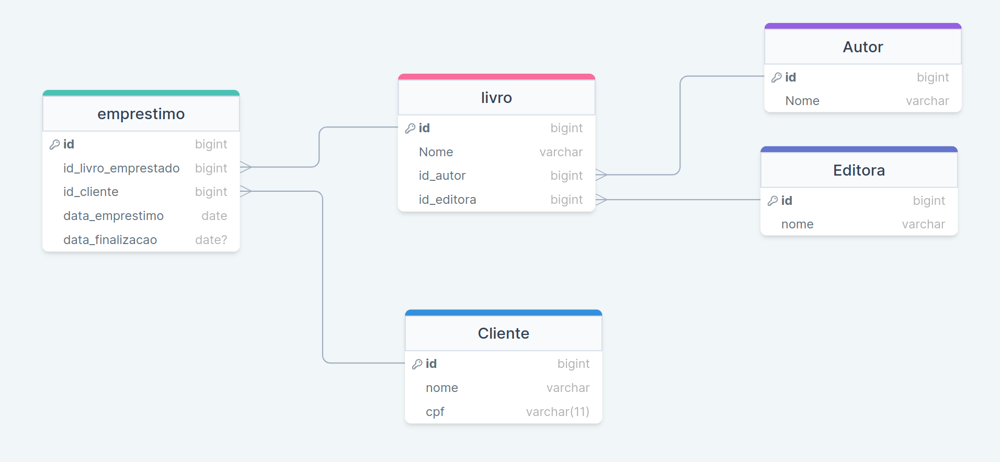

# Sistema de Biblioteca

Este é um sistema de biblioteca que permite gerenciar livros, autores, editoras, clientes e empréstimos.

# Modelo

## Funcionalidades

- Cadastro, consulta, atualização e exclusão de livros.
- Cadastro, consulta, atualização e exclusão de autores.
- Cadastro, consulta, atualização e exclusão de editoras.
- Cadastro, consulta, atualização e exclusão de clientes.
- Registro, consulta e devolução de empréstimos.

## Tecnologias Utilizadas

- Java
- Spring Framework
- Hibernate/JPA
- PostgreSQL

## Configuração do Ambiente de Desenvolvimento

1. Clone este repositório.
2. Configure o banco de dados PostgreSQL e importe o esquema do banco de dados (script SQL fornecido em `/database/schema.sql`).
3. Abra o projeto.
4. Configure as credenciais do banco de dados no arquivo `application.properties`.
5. Execute a aplicação.

## Endpoints da API

Para mais detalhes sobre os endpoints da API e como utilizá-los, consulte a seção de [Endpoints da API](#endpoints-da-api).

## Autor

João Vitor Nascimento Ramos

## Endpoints da API

A seguir, estão listados os endpoints disponíveis na API:

- **Autores:** `/autores/`
  - POST: Cria um novo autor.
  - GET: Retorna todos os autores.
  - GET /{id}: Retorna um autor específico.
  - PUT /{id}: Atualiza um autor específico.
  - DELETE /{id}: Exclui um autor específico.

- **Clientes:** `/clientes/`
  - POST: Cria um novo cliente.
  - GET: Retorna todos os clientes.
  - GET /{id}: Retorna um cliente específico.
  - PUT /{id}: Atualiza um cliente específico.
  - DELETE /{id}: Exclui um cliente específico.

- **Editoras:** `/editoras/`
  - POST: Cria uma nova editora.
  - GET: Retorna todas as editoras.
  - GET /{id}: Retorna uma editora específica.
  - PUT /{id}: Atualiza uma editora específica.
  - DELETE /{id}: Exclui uma editora específica.

- **Livros:** `/livros/`
  - POST: Cria um novo livro.
  - GET: Retorna todos os livros.
  - GET /{id}: Retorna um livro específico.
  - PUT /{id}: Atualiza um livro específico.
  - DELETE /{id}: Exclui um livro específico.

- **Empréstimos:** `/emprestimos/`
  - POST: Registra um novo empréstimo.
  - GET: Retorna todos os empréstimos.
  - GET /{id}: Retorna um empréstimo específico.
  - PUT /{id}: Atualiza um empréstimo específico.
  - DELETE /{id}: Exclui um empréstimo específico.
  - PUT /devolucao/{id}: Registra a devolução de um livro.

