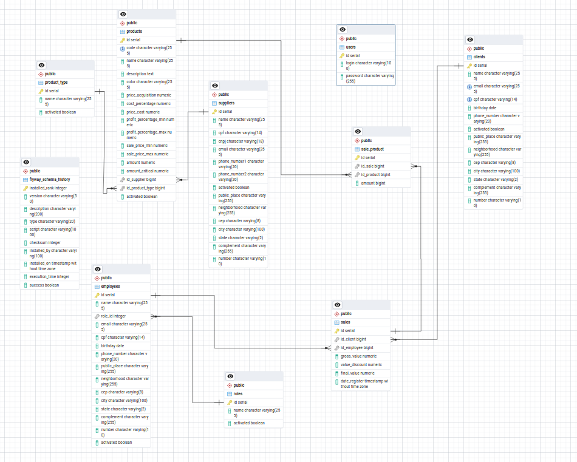

# Business API README

## Overview
The Business API is a comprehensive system for managing sales, products, clients, employees, and more within a business environment. It provides endpoints for various CRUD operations and business logic related to these entities.

## Database Schema

## Technologies Used
- Java
- Spring Boot
- PostgreSQL
- Hibernate
- Spring Security
- Swagger for API documentation

## Security
The API includes token-based authentication using Spring Security to ensure secure access to endpoints. Only authorized users with valid tokens can interact with the API.

Sensitive information such as database credentials and tokens are managed securely using environment variables.

## Endpoints

### Sales Controller (`/v1/sales`)
- `POST /sales`: Register a new sale.
- `GET /sales`: Get a list of sales.
- `GET /sales/{id}`: Get details of a specific sale.
- `PUT /sales/{id}`: Update a sale.
- `DELETE /sales/{id}`: Delete a sale.

### Products Controller (`/v1/products`)
- `POST /products`: Register a new product.
- `GET /products`: Get a list of products.
- `GET /products/{id}`: Get details of a specific product.
- `PUT /products/{id}`: Update a product.
- `DELETE /products/{id}`: Delete a product.

### Clients Controller (`/v1/clients`)
- `POST /clients`: Register a new client.
- `GET /clients`: Get a list of clients.
- `GET /clients/{id}`: Get details of a specific client.
- `PUT /clients/{id}`: Update a client.
- `DELETE /clients/{id}`: Delete a client.

### Employees Controller (`/v1/employees`)
- `POST /employees`: Register a new employee.
- `GET /employees`: Get a list of employees.
- `GET /employees/{id}`: Get details of a specific employee.
- `PUT /employees/{id}`: Update an employee.
- `DELETE /employees/{id}`: Delete an employee.

### Suppliers Controller (`/v1/supplier`)
- `POST /supplier`: Register a new supplier.
- `GET /supplier`: Get a list of suppliers.
- `GET /supplier/{id}`: Get details of a specific supplier.
- `PUT /supplier/{id}`: Update a supplier.
- `DELETE /supplier/{id}`: Delete a supplier.

### Product Types Controller (`/v1/product/types`)
- `POST /product/types`: Register a new product type.
- `GET /product/types`: Get a list of product types.
- `GET /product/types/{id}`: Get details of a specific product type.
- `PUT /product/types/{id}`: Update a product type.
- `DELETE /product/types/{id}`: Delete a product type.

### Roles Controller (`/v1/employees/roles`)
- `POST /employees/roles`: Register a new role.
- `GET /employees/roles`: Get a list of roles.
- `GET /employees/roles/{id}`: Get details of a specific role.
- `PUT /employees/roles/{id}`: Update a role.
- `DELETE /employees/roles/{id}`: Delete a role.

## Deployment
Before deploying the application, make sure to configure the necessary environment variables, including database connection details and security tokens. The application is designed to work with PostgreSQL as the database backend.

## Documentation
API documentation is generated using Swagger. Accessing the API endpoints via a web browser after running the application will provide detailed information about each endpoint, including request and response schemas.

